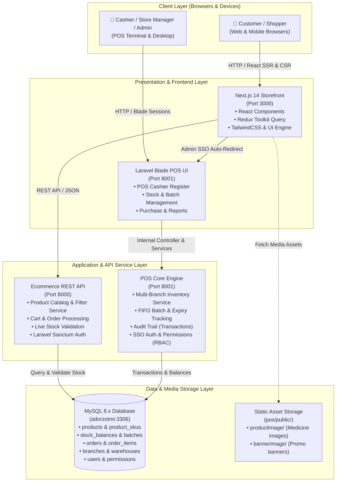

# Adorzotno — E-Commerce & Pharmacy POS Stack

A full-stack enterprise Pharmacy Management & E-Commerce ecosystem comprising a modern Next.js customer storefront, a Laravel REST API backend, and a comprehensive Laravel POS & Inventory Management system.

---

## 🏛️ Architecture & Services Overview

| Component | Technology | Directory | Default Port | Description |
| :--- | :--- | :--- | :--- | :--- |
| **Storefront** | Next.js 14, React, TailwindCSS, Redux Toolkit | `adorzotno/` | `http://localhost:3000` | Customer-facing medicine & personal care shop |
| **POS & Admin** | Laravel 11, Blade, Bootstrap 5, DataTables | `adorzotno-pos/pos/` | `http://localhost:8001` | Pharmacy Point of Sale, multi-branch inventory & reports |
| **Storefront API** | Laravel 11 REST API, Sanctum | `adorzotno-pos/ecommerce-api/` | `http://localhost:8000` | High-performance catalog, cart, and order API |
| **Database** | MySQL 8.x | `database/` | `3306` (`adorzotno`) | Complete pre-seeded database with 6,003 products & stocks |

---

## 📐 System Architecture

### 1. High-Level Architecture Diagram



---

### 2. Architectural Layers & Responsibilities

#### A. Client & Presentation Layer
- **Next.js Customer Storefront (`:3000`)**:
  - Built with Next.js 14 App Router, React 18, TailwindCSS, and Redux Toolkit (`productApi`, `cartApi`, `authApi`).
  - Features real-time search, category navigation, dynamic medicine dosage display, brand filters, and full cart checkout.
  - Automatically queries the `ecommerce-api` to display accurate **"In Stock"** vs **"Out of Stock"** status and disables checkout if inventory is depleted.
- **POS & Admin Dashboard (`:8001`)**:
  - Built with Laravel Blade, Bootstrap 5, and server-side DataTables.
  - Provides rapid barcode checkout for physical pharmacy counters, prescription uploads, inventory receiving, batch tracking, and sales analytics.

#### B. Application & API Layer
- **Ecommerce REST API (`:8000`)**:
  - Stateless JSON API built on Laravel 11.
  - Serves product endpoints (`/api/products/{slug}`, `/api/products/flash-deals`, `/api/products/trending`).
  - Calculates real-time available stock per SKU dynamically by querying `stock_balances` across warehouses:
    $$\text{Available Stock} = \sum \max(0, \text{available\_quantity} - \text{reserved\_quantity})$$
- **POS & Inventory Service Engine (`:8001`)**:
  - Manages warehouse allocations, stock transfers between branches, purchase orders, and inventory adjustments.
  - Incorporates **Single Sign-On (SSO)**: When an admin logs in on the storefront, the API returns `admin_redirect_url` with an encrypted one-time token that automatically authenticates and redirects them into the POS Admin dashboard on port 8001.

#### C. Data & Persistence Layer
- **Unified MySQL Database (`adorzotno:3306`)**:
  - Both `ecommerce-api` and `pos` connect to the same central database, guaranteeing **100% data consistency** without asynchronous synchronization delays.
  - Core Schema Entities:
    - `products` & `product_skus`: Catalog, generic names, pricing, dosage, and strengths.
    - `branches` & `warehouses`: Multi-branch hierarchy (Mirpur Warehouse, Banani Warehouse, Uttara Warehouse).
    - `stock_balances`: Warehouse-level real-time inventory counts indexed by `(branch_id, warehouse_id, sku_id, batch_id)`.
    - `inventory_batches`: FIFO batch management with batch numbers, purchase costs, manufacture dates (`manufacture_date`), and expiry dates (`expiry_date`).
    - `inventory_transactions`: Immutable double-entry audit log of every stock movement (purchases, opening stock, adjustments, transfers, and sales).

---

### 3. Real-Time Stock Lifecycle & Sync Workflow

```
[Admin / Warehouse Staff]
        │
        ▼
   (Add / Edit / Delete Stock)
        │
        ▼
┌────────────────────────────────────────────────────────┐
│  AvailableStockController (Port 8001)                  │
│  1. Updates `inventory_batches` (batch_no, mfg, exp)   │
│  2. Updates `stock_balances` (available_quantity)      │
│  3. Logs audit trail in `inventory_transactions`       │
└────────────────────────────────────────────────────────┘
        │
        ├──► POS Screen (Port 8001): Immediately sees new batch & available stock
        │
        └──► Storefront API (Port 8000):
             BaseApiController reads updated `stock_balances`
                  │
                  ▼
             Next.js Storefront (Port 3000):
             Product instantly switches from "Out of Stock" to "In Stock",
             updating live available quantity and enabling "Add to Cart"!
```

---

## 📋 Prerequisites / প্রয়োজনীয় সফটওয়্যার

Before running the setup, ensure your system has the following installed:
1. **PHP 8.2 or 8.3** (with `pdo_mysql`, `curl`, `mbstring`, `zip`, `fileinfo` extensions enabled)
2. **Composer 2.x**
3. **Node.js 18+ or 20+** & **npm**
4. **MySQL 8.x** (running on default port 3306)

> **💡 Tip for Windows Users:** You can use [Laragon](https://laragon.org/) (Full version) which includes PHP, Composer, Node.js, and MySQL out-of-the-box. Just start Laragon and MySQL!

---

## 🚀 Quick Start (Automated 1-Command Setup)

### English:
1. Clone this repository:
   ```powershell
   git clone https://github.com/jimhpar/pharma.git
   cd pharma
   ```
2. Run the automated setup script in PowerShell:
   ```powershell
   .\setup.ps1
   ```

### বাংলা নির্দেশনা:
১. রিপোজিটরিটি ক্লোন করে প্রোজেক্ট ফোল্ডারে PowerShell ওপেন করুন।
২. শুধুমাত্র নিচের কমান্ডটি দিয়ে এন্টার দিন:
   ```powershell
   .\setup.ps1
   ```

### What `setup.ps1` does automatically:
- Checks all prerequisites (PHP, Composer, Node, MySQL).
- Connects to MySQL, creates the database `adorzotno`, and imports the complete database dump (`database/adorzotno_complete.sql`) containing all 6,003 products, 4,000 seeded inventory stocks, batches, categories, and admin accounts without any data loss.
- Sets up `.env` files for `ecommerce-api` and `pos`, and `.env.local` for `adorzotno`.
- Runs `composer install` for both Laravel backends.
- Generates application encryption keys (`php artisan key:generate`).
- Runs `npm install` and builds assets (`npm run build`).

---

## ⚡ Running the Applications (1-Click Run)

### Option A: One-Click Runner (Recommended)
Simply **double-click `start.bat`** in the project folder, or run:

```powershell
.\run.ps1
```

This concurrently launches:
- **Ecommerce API** on `http://localhost:8000`
- **POS Admin** on `http://localhost:8001`
- **Next.js Storefront** on `http://localhost:3000`

And automatically opens `http://localhost:3000` in your default browser.

### Option B: Stopping the Applications
To stop all three running servers cleanly at any time, run:

```powershell
.\stop.ps1
```

---

## 🔑 Default Credentials & Access URLs

| Portal | URL | Credentials / Notes |
| :--- | :--- | :--- |
| **Storefront Website** | `http://localhost:3000` | Browse & purchase products directly |
| **POS / Admin Dashboard** | `http://localhost:8001` | **Email:** `admin@gmail.com`<br>**Password:** `12345678` |
| **API Server** | `http://localhost:8000` | REST API endpoints for storefront |

---

## 📦 Key Modules in POS & Admin

- **Available Stock Management** (`/available-stock/show`):
  - View real-time **Central Stock** (aggregated across all warehouses) and individual branch breakdowns (**Mirpur**, **Banani**, **Uttara**).
  - Search by Product Name, SKU ID / Code, or Barcode.
  - Track **Manufacture Dates** & **Expiry Dates** for each batch.
  - **Add, Edit, and Delete** stock batches with instant live reflection on the online storefront.
- **Point of Sale (POS)** (`/pos`):
  - Rapid barcode scanning, strip/medicine unit calculations, and receipt printing.
- **Inventory Documents**:
  - Purchase Orders, Opening Stock, Stock Issues, Adjustments, and Stock Transfers between branches.

---

## 📄 License
This project is proprietary software developed for Adorzotno Limited.
